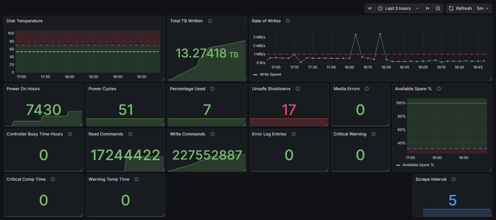

# OPNsense-node-exporter-smartctl-collect

This repo contains a shell script and a `configd` action to collect SMART data from an NVMe drive and expose it to Prometheus via the Node Exporter plugin and textfile collector on an OPNsense router.

## Grafana Dashboard

I've created a Grafana Dashboard for visualizing these Smartctl metrics, it can be found here: https://grafana.com/grafana/dashboards/24771 or in this repo as `24771.json`

## Required OPNsense Plugins

*   **os-node_exporter** To collect and expose metrics to Prometheus
*   **os-smart** Required for `smartctl`

## Files

*   `smart-metrics.sh`: The data collection script. It runs `smartctl`, parses the output with Python, and writes a `.prom` file to the Node Exporter textfile directory.
*   `actions_smartmetrics.conf`: Configuration file allowing the script to be triggered via OPNsense's `configd` system (and thus the Cron scheduler).

## Installation

1. **Install the required plugins listed above**

2.  **Copy the script**:
    Upload `smart-metrics.sh` to your OPNsense device, place it in `/usr/local/bin/`, and make it executable with `chmod +x /usr/local/bin/smart-metrics.sh`

    *Note: The script is currently hardcoded for an NVMe drive at `/dev/nvme0`. If your drive is at a different path, edit the `DEVICE` variable in the script.*

3.  **Copy the action configuration**:
    Upload `actions_smartmetrics.conf` to `/usr/local/opnsense/service/conf/actions.d/`.

4.  **Reload configd**:
    To register the new action, restart the config daemon with `service configd restart`

## Usage & Cron Setup

### Manual Test

You can test if the action is registered correctly by running `configctl smartmetrics collect`

This should generate the file at `/var/tmp/node_exporter/smart_metrics.prom`

### Setup Cron Job

To collect metrics on a schedule:

1.  Go to **System > Settings > Cron**.
2.  Click the **+** button to add a new job.
3.  **Command**: Select `Collect SMART Metrics for Node Exporter` from the dropdown.
4.  **Schedule**: Set your interval; I use every 5 minutes. *(You'll need to update the Grafana Rate of Writes panel `interval` to match if you change this to avoid artifacts)*
5.  Click **Save**.

## Exposed Metrics

The following metrics are exported and can be found in Prometheus. I use Grafana to visualize them. Each metric includes a `device` label (e.g. `device="nvme0"`).

**NOTE**: These are all metrics found under the `nvme_smart_health_information_log` object of the JSON output of smartctl. If you're having problems, run `smartctl -j -a /dev/nvme0` (or your device path) to see if your drive supports these metrics.

* `node_disk_smart_critical_warning` — Critical warning state (0 = good).
* `node_disk_smart_temperature_celsius` — Current drive temperature (°C).
* `node_disk_smart_available_spare_percent` — Available spare capacity (%).
* `node_disk_smart_available_spare_threshold_percent` — Available spare threshold (%).
* `node_disk_smart_percentage_used_percent` — Percentage of drive life used (%).
* `node_disk_smart_data_units_read_total` — Total data units read (units reported by firmware).
* `node_disk_smart_data_units_written_total` — Total data units written (units reported by firmware).
* `node_disk_smart_host_read_commands_total` — Total host read commands.
* `node_disk_smart_host_write_commands_total` — Total host write commands.
* `node_disk_smart_controller_busy_time_minutes_total` — Controller busy time (minutes).
* `node_disk_smart_power_cycles_total` — Total power cycles.
* `node_disk_smart_power_on_hours_total` — Total power-on hours.
* `node_disk_smart_unsafe_shutdowns_total` — Total unsafe shutdowns.
* `node_disk_smart_media_errors_total` — Total media and data integrity errors.
* `node_disk_smart_error_log_entries_total` — Total error log entries.
* `node_disk_smart_warning_temp_time_minutes_total` — Time (minutes) the drive has been above the warning temperature.
* `node_disk_smart_critical_comp_time_minutes_total` — Time (minutes) the drive has been above the critical temperature.

## To-Do

1. Add support for SATA drives.
   1. If you're running a SATA drive, please contribute a sample output to [smartctl-outputs.md](smartctl-outputs.md)
2. Collect Model and Serial Number?
3. Collect self test info?
4. Add param for drive TBW and calculate estimated remaining life?